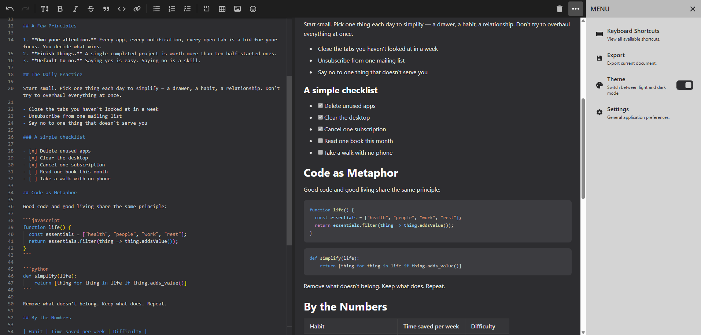

# RunQi – Markdown Editor

A friendly, powerful, and fully customizable open-source in-browser Markdown editor with real-time preview.



## Tech Stack


## Getting Started

### Prerequisites

- [Node.js](https://nodejs.org/) v18 or higher
- npm or yarn

### Installation

```bash
# Clone the repository
git clone https://github.com/malmorox/runqi-md.git
cd runqi-md

# Install dependencies
npm install

# Start the development server
npm run dev
```
Open http://localhost:5173 in your browser.

### Build for production
```bash
npm run build
```

## Contributing

Contributions are what make open source great. Any contribution you make is **greatly appreciated**.

### How to contribute

1. **Fork** the repository
2. **Create** your feature branch (`git checkout -b feature/amazing-feature`)
3. **Commit** your changes (`git commit -m 'Add some amazing feature'`)
4. **Push** to the branch (`git push origin feature/amazing-feature`)
5. **Open a Pull Request**
